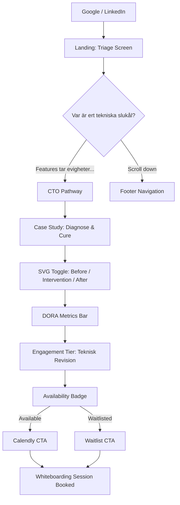
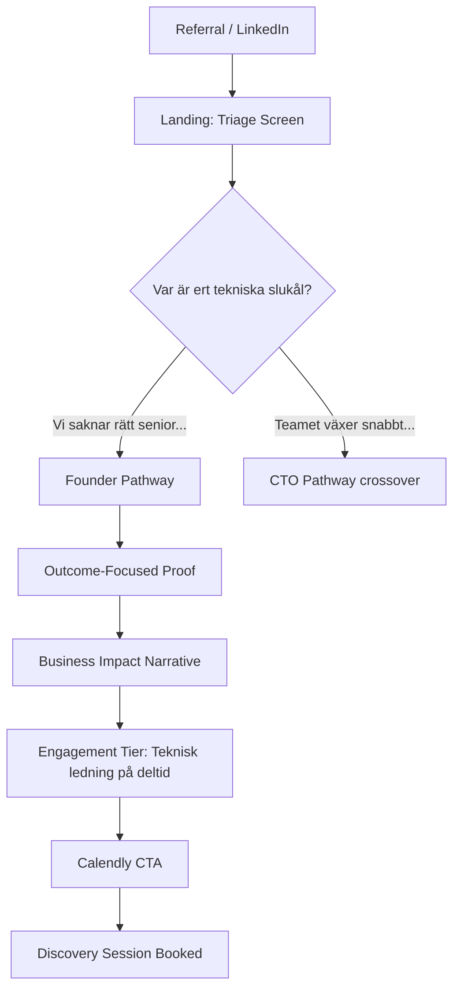
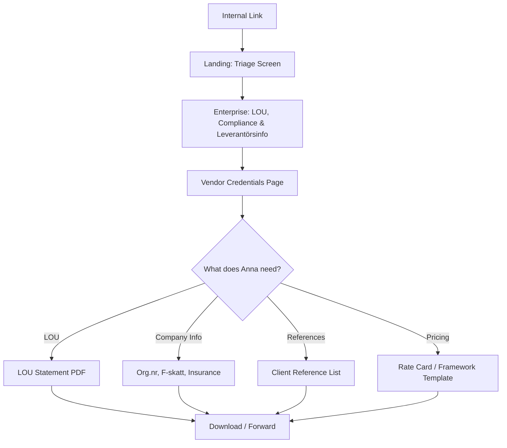

# UX Design Specification — enhancior.se

**Author:** Rasmus
**Date:** 2026-02-20

---

## Executive Summary

### Project Vision

Enhancior.se inverts the standard professional services website paradigm. Instead of presenting credentials for visitors to evaluate, it immediately diagnoses visitor pain through an "ER Triage" homepage — a stark, dark-mode screen asking "Where is the system bleeding?" Visitors self-select their symptom, triggering persona-routed pathways that deliver targeted proof of competence directly relevant to their specific crisis. The UX thesis: diagnostic-first positioning transforms discovery call quality and pre-sells authority before any human interaction.

The site is a solo consultancy's 24/7 autonomous sales engineer — built on Next.js/Vercel with aggressive SSG, targeting 100/100 Lighthouse across all categories, wrapped in a Michelin-Star dark-mode aesthetic that itself serves as proof of elite engineering craft.

### Target Users

| Persona | Mental State | Device | UX Need |
|---------|-------------|--------|---------|
| **CTO Under Pressure (Erik)** | Stressed, browsing late, needs peer credibility | Desktop + phone | Immediate recognition of pain, technical depth, fast path to booking |
| **Non-Technical Founder (Sara)** | Anxious, doesn't speak tech, on the move | Phone (primary) | Non-intimidating language, business outcomes framing, trust via story |
| **Enterprise Procurement (Anna)** | Task-oriented, checkbox-driven, time-pressured | Desktop | Bypass triage, find credentials <30 sec, download PDF, leave |
| **Content Owner (Rasmus)** | Developer, efficient, hates CMS | IDE | Git-push workflow, zero friction |

### Key Design Challenges

1. **The Triage Paradox** — The ER Triage must feel authoritative to a CTO, non-intimidating to a Founder, and skippable for Procurement. Three conflicting emotional responses on one screen.

2. **Minimal Navigation, Maximum Findability** — The site deliberately avoids a standard nav bar in favor of triage-driven routing. But Anna (Procurement) needs to bypass the triage entirely. The footer nav must be discoverable without undermining the triage-first experience.

3. **Dark Mode Accessibility** — Michelin-Star dark-mode aesthetic meets WCAG 2.1 AA compliance. High contrast ratios on dark backgrounds require careful color palette design. Architecture SVG diagrams need to be legible, beautiful, AND screen-readable.

4. **Mobile Triage as Native App** — The triage flow on phone must feel like a premium native app (44×44px targets, zero layout shift, silky transitions), not a responsive website.

### Design Opportunities

1. **Emotional Architecture** — The stark "Where is the system bleeding?" on a dark screen creates an instant emotional connection. Every pixel serves the moment.

2. **Storytelling Through Interaction** — The three-state SVG Diagnose & Cure component (Bleeding → Intervention → Cure) is a narrative interaction where transitions themselves tell the story of competence.

3. **Progressive Disclosure Mastery** — Each persona pathway delivers exactly the right proof artifact at the right moment — surgical delivery of credibility tailored to who's looking.

## Core User Experience

### Defining Experience

The core action is **self-diagnosis through triage selection**. The moment a visitor clicks a symptom on the ER Triage screen, the site has delivered its value proposition — it recognized their pain before they said a word. Every subsequent interaction (case study reading, tier exploration, booking) is downstream conversion from that single decisive click.

The site does not ask "How can I help you?" It says "I already know what's wrong."

### Platform Strategy

| Dimension | Decision |
|-----------|----------|
| **Platform** | Web-only — no native apps, no PWA |
| **Architecture** | Next.js SSG with mandatory route pre-fetching for persona pathways |
| **Primary Input** | Touch on mobile (thumb taps for triage), mouse/keyboard on desktop (diagram exploration) |
| **Offline** | Not required — static CDN delivery ensures near-instant load regardless |
| **CDN** | Vercel Edge Network — global performance without infrastructure management |

### Effortless Interactions

Four interactions that must feel like they require **zero thought**:

1. **Triage → Persona Content** — Mathematically instant. Next.js pre-fetches all persona pathway routes from the triage screen. When the visitor taps a symptom, the content appears to already be there. No loading spinner, no skeleton screen, no perceptible delay.

2. **Reading → Booking** — The Calendly CTA must feel like a natural continuation of reading, not a separate "sales" action. The transition from case study to booking should feel like turning a page, not clicking an ad.

3. **Triage Bypass (Procurement)** — A persistent, subtle, yet highly legible "Enterprise Compliance & Vendor Info" link at the bottom of the triage screen. Anna never fights the design — she sees her exit immediately and uses it. Zero clash with the triage-first experience.

4. **Diagnose & Cure SVG Toggle** — Switching between Before/Intervention/After states must feel like a buttery-smooth native state change, not navigating a gallery. The user's thumb/mouse glides over the toggle and the system responds instantly — Framer Motion crossfade with no perceptible render delay.

### Critical Success Moments

**The 2-Second Window (Make-or-Break):**

The defining moment is the first 2 seconds after initial page load. If the visitor encounters a generic fade-in animation, a cookie banner blocking text, or a layout shift — the Michelin-Star / Special Forces illusion shatters permanently. The visitor must be hit immediately with:

- Stark dark-mode minimalism
- The piercing question: "Var är ert tekniska slukål?" / "Where is the system bleeding?"
- Flawless typography (no FOUT, no layout reflow)
- The sensation of being granted access to a high-end diagnostic tool, not visiting a marketing website

If we nail this 2-second window, the rest of the funnel converts itself.

**Secondary Success Moments:**
- **Triage click → "someone gets it" confirmation** — content so precisely targeted to their pain that it feels bespoke
- **Case study recognition** — CTO sees an architecture diagram eerily similar to their own disaster
- **Pricing transparency** — Founder sees a number that fits their burn rate, without needing to "request a quote"

### Experience Principles

| Principle | Description |
|-----------|-------------|
| **Diagnosis Before Introduction** | The site diagnoses, it doesn't introduce. Every element serves the diagnostic frame. |
| **Instant Confidence** | Every transition, load, and interaction must feel mathematically instant. Perceived delay = perceived incompetence. |
| **Surgical Relevance** | Show only what matters to whoever is looking. Zero information overload. Progressive disclosure, not progressive clutter. |
| **The Site Is the Proof** | The technical execution of the site (performance, animation quality, accessibility) is itself the competence proof. The medium is the message. |
| **Accessible Exclusivity** | Feel exclusive and premium while meeting WCAG 2.1 AA. Accessibility and luxury are not in tension — they reinforce each other. |

## Desired Emotional Response

### Primary Emotional Goals

| Persona | Primary Emotion | The "Tell a Friend" Moment |
|---------|----------------|---------------------------|
| **Erik (CTO)** | Recognition — "someone speaks my language" | Sends the link to his Slack: *"Finally, an architect who actually gets how much of a nightmare this legacy codebase is."* |
| **Sara (Founder)** | Relief — "someone explained this without making me feel dumb" | Tells a fellow founder: *"I can actually explain this to my board now."* |
| **Anna (Procurement)** | Efficiency — task completed without friction | Tells a colleague: *"I wish every consultant packaged their LOU compliance this cleanly. Saved me two hours of emailing."* |

### Emotional Journey Mapping

| Stage | Erik (CTO) | Sara (Founder) | Anna (Procurement) |
|-------|-----------|---------------|-------------------|
| **First impression** | Relief — "someone speaks my language" | Safety — "this isn't intimidating" | Efficiency — "I can find what I need fast" |
| **Triage selection** | Recognition — "they already know my problem" | Empowerment — "I can describe my pain without tech jargon" | N/A — bypasses via Enterprise Compliance link |
| **Content consumption** | Peer respect — "this person is at my level" | Hope — "someone has solved this before" | Compliance confidence — "checkboxes are met" |
| **Conversion moment** | Urgency + trust — "I need to book before availability closes" | Relief — "the budget works, the timeline works" | Task complete — "shortlist updated, moving on" |

### Micro-Emotions

- **Confidence over Confusion** — Every interaction reinforces "I know what to do next." Zero cognitive load in navigation.
- **Trust over Skepticism** — Transparent pricing brackets, verifiable credentials, real case study metrics. Nothing hidden.
- **Exclusivity over Scarcity** — The feeling of accessing a sought-after restaurant, not a marketing funnel. Finite capacity is operational truth, not conversion tactic.
- **Accomplishment over Frustration** — Booking a whiteboarding session should feel like securing something valuable, not filling out a form.

### Emotions to Avoid

| ❌ Avoid | Why | Design Safeguard |
|----------|-----|-----------------|
| **Intimidation** | Sara must never feel stupid or out of her depth | Business-language copy on Founder pathway; zero unexplained jargon |
| **Distrust** | Pricing opacity breeds suspicion | Transparent starting-price brackets on all engagement tiers |
| **Manufactured Urgency** | Countdown timers and pulsing CTAs shatter premium positioning | No fake scarcity mechanics. Availability badge reflects real capacity. |
| **Commoditization** | Visitors must never feel they're buying "hours" or "a warm body" | Engagement tiers sell outcomes and interventions, not time blocks. Framing is always outcome-first. |

### Authentic Scarcity vs. Fake Pressure

The site induces FOMO based on **operational reality**, not manipulation. As a solo practitioner, capacity is mathematically finite. The availability badge ("🟢 1 slot opening Q3") is operational transparency — like a sought-after restaurant's wait list. The emotion is *respectful urgency*: "This person is clearly in demand, and I should act if I want access." Never: "BUY NOW BEFORE TIME RUNS OUT."

### Emotional Design Principles

| Principle | UX Implication |
|-----------|---------------|
| **Diagnose, Don't Sell** | Copy tone is clinical precision, not marketing enthusiasm. No exclamation marks, no superlatives. |
| **Earned Confidence** | Authority is demonstrated through artifacts (case studies, diagrams), never claimed through adjectives ("world-class," "leading"). |
| **Respectful Urgency** | Scarcity signals are factual and understated. Availability badge, not countdown timer. |
| **Outcome Framing** | Every price, every tier, every CTA is framed around what the client receives, not what the consultant does. |
| **Inclusive Exclusivity** | Premium feel without gatekeeping. WCAG 2.1 AA compliance means the exclusive experience is available to everyone. |

## UX Pattern Analysis & Inspiration

### Inspiring Products Analysis

**Linear (linear.app) — The Precision Instrument**

| Dimension | What Linear Does | What We Steal |
|-----------|-----------------|---------------|
| **Speed** | Everything feels instant — optimistic UI, no loading states | Triage selection must feel as snappy as creating a Linear issue |
| **Keyboard-first** | Power users never touch the mouse | Full keyboard navigation as a premium signal, not just accessibility |
| **Opinionated design** | Unapologetic defaults, no "customize everything" clutter | One triage flow, one aesthetic, one voice. Confidence, not options. |
| **Command palette** | ⌘K summons a dark, centered, instantly responsive interface | ER Triage homepage should evoke the command palette: dark, centered, purposeful |

**Vercel (vercel.com) — The Infrastructure Authority**

| Dimension | What Vercel Does | What We Steal |
|-----------|-----------------|---------------|
| **Negative space** | Massive whitespace draws the eye precisely | Every page should breathe. No visual clutter competing with the diagnostic message. |
| **Monochromatic contrast** | Black/white with surgical accent color | Dark background, stark white typography, single accent for CTAs |
| **Authoritative tone** | Copy reads like documentation, not marketing | Clinical precision in every sentence. The site IS infrastructure. |

**High-End Architectural Firms (Foster + Partners, Olson Kundig) — The Blueprint Aesthetic**

| Dimension | What They Do | What We Steal |
|-----------|-------------|---------------|
| **Blueprint over marketing** | Projects speak for themselves | Diagnose & Cure case studies are the portfolio. Work proves competence. |
| **Vast negative space** | Massive canvas with sparse, intentional elements | Desktop blueprint canvas — architecture diagrams float in generous space |
| **Stark typography** | Type does all the heavy lifting | Inter/Geist font family, typography as primary design element, not imagery |

### Transferable UX Patterns

| Pattern | Source | Application in enhancior.se |
|---------|--------|---------------------------|
| **Command palette UX** | Linear, Raycast | ER Triage homepage: dark, centered diagnostic prompt, instantly responsive |
| **Optimistic UI / instant transitions** | Linear | Triage → persona content via SSG pre-fetching, zero perceived delay |
| **Progressive information density** | Vercel docs | Persona pathways start sparse, reveal depth progressively |
| **Full-bleed hero with single focal point** | Architectural firms | Triage screen: one question, vast dark space, nothing competing |
| **Subtle depth cues** | Raycast | 1px borders, controlled glow effects for hierarchy on dark backgrounds |

### Anti-Patterns to Avoid

| ❌ Anti-Pattern | Example | Why It Fails |
|----------------|---------|-------------|
| **Megacorp visual bloat** | Accenture, Capgemini | Stock photos of suits at whiteboards, mega-menus, corporate word salad |
| **Corporate Memphis illustrations** | unDraw, generic SaaS | Flat pastel vectors signal "playful startup," antithetical to Special Forces |
| **Bouncing/playful animations** | "Code Rockstars" dev shops | Undermines clinical precision. Our animations are purposeful, not decorative. |
| **"Synergize" copy** | Enterprise consulting sites | Jargon-heavy word salad. Our copy is direct, specific, and clinical. |
| **Light-mode defaults** | Most consultancy sites | Dark mode IS the aesthetic. No light mode variant. |

### Dark Mode Standard

| Property | Specification |
|----------|---------------|
| **Background** | Deep off-blacks (#0A0A0A, #111111) — NOT pure #000000 |
| **Text** | High-contrast off-white — NOT blinding #FFFFFF |
| **Depth system** | Subtle 1px borders and controlled glow effects for hierarchy |
| **Accent** | Single, surgically applied accent color for CTAs and interactive elements |
| **Benchmark** | If the ER Triage feels like summoning the Raycast command palette — dark, centered, instantly responsive, deeply purposeful — we have won |

### Design Inspiration Strategy

**Adopt directly:**
- Linear's command palette spatial model → ER Triage homepage
- Raycast's dark-mode depth system → site-wide surface hierarchy
- Vercel's monochromatic authority → typography and layout system

**Adapt for our context:**
- Architectural firm portfolio structure → Diagnose & Cure case studies (add interactivity via SVG toggle)
- Linear's keyboard-first philosophy → accessibility-first (serves both power users and screen readers)

**Reject entirely:**
- All stock photography
- All decorative illustration
- All playful/bouncing animation
- All enterprise consulting visual language
- Light mode

## Design System Foundation

### Design System Choice

**shadcn/ui + Tailwind CSS** — themeable primitives approach providing full visual control with accessible, copy-paste component sources built on Radix UI.

### Rationale for Selection

| Factor | Why shadcn/ui + Tailwind |
|--------|------------------------|
| **Full visual ownership** | Components are source code you own, not library dependencies. Every pixel customizable. |
| **Dark-mode native** | CSS variables + Radix primitives. Dark mode is the default state, not a toggle. |
| **Accessibility built-in** | Radix UI provides keyboard navigation, focus management, ARIA patterns — WCAG 2.1 AA comes nearly free. |
| **Zero styling runtime** | Tailwind CSS extracts at build time. No JavaScript overhead. Protects 100/100 Lighthouse. |
| **AI agent workflow** | First-class support in Cursor and v0. AI agents generate shadcn components natively. |
| **Inspiration alignment** | Vercel, Linear, and Raycast all use utility-first CSS approaches. Same design language. |

### Typography System

**All-in on Geist** — Vercel's purpose-built typeface family, loaded via `next/font` for zero CLS.

| Variant | Usage | Rationale |
|---------|-------|-----------|
| **Geist Sans** | Headings, body copy, navigation, CTAs | Clean, aggressively modern, highly legible. Primary UI typeface. |
| **Geist Mono** | Metrics, availability badge, case study data, SVG diagram labels | "Developer terminal / blueprint" aesthetic. Hard data in mono = precision signal. |

**Typography rules:**
- Geist Sans and Geist Mono are the ONLY typefaces. No fallback to Inter, no visible system fonts.
- `next/font` self-hosts font files, eliminating external requests and CLS.
- Mono variant deployed strategically for data points and labels — never for body copy.

### Implementation Approach

| Layer | Tool | Responsibility |
|-------|------|---------------|
| **Design tokens** | Tailwind CSS config | Colors, spacing, typography scale, breakpoints |
| **Component primitives** | shadcn/ui (Radix) | Buttons, dialogs, navigation, toggles — accessible patterns |
| **Custom components** | React + Tailwind | ER Triage selector, SVG toggle, persona pathway cards |
| **Animation** | Framer Motion | SVG state transitions, route transitions, micro-interactions |
| **Layout** | CSS Grid + Flexbox | Responsive grid, blueprint canvas on desktop, mobile-first stack |

### Customization Strategy

**Design token overrides (Tailwind config):**

| Token Category | Specification |
|---------------|---------------|
| **Background** | `--background: #0A0A0A` (deep off-black, not pure black) |
| **Foreground** | `--foreground: #EDEDED` (off-white, not blinding white) |
| **Border** | Subtle 1px with low-opacity white for depth hierarchy |
| **Accent** | Single surgical accent color for CTAs (TBD in color palette step) |
| **Radius** | Minimal — sharp corners or very slight rounding. No rounded pills. |
| **Glow** | Controlled box-shadow glow effects for interactive hover states |

**Custom component priorities:**
1. ER Triage selector — command palette spatial model
2. Diagnose & Cure SVG toggle — Framer Motion three-state transitions
3. Engagement tier cards — dark-mode depth treatment
4. Calendly embed wrapper — styled container preserving aesthetic

## Defining Core Experience

### Defining Experience Statement

> **"Tell me where it hurts, and I'll show you I've already fixed it."**

The ER Triage is not a navigation pattern — it's a diagnostic ritual. The visitor confesses a symptom; the site proves it already knows the cure.

### User Mental Model

| Persona | What They Think They're Doing | What Actually Happens |
|---------|------------------------------|----------------------|
| **Erik (CTO)** | "Checking if this consultant understands my specific chaos" | Gets pre-sold by seeing his exact crisis solved in a case study |
| **Sara (Founder)** | "Trying to explain a tech problem without sounding dumb" | Sees business-outcome language that validates her pain without jargon |
| **Anna (Procurement)** | "I need vendor docs, not a sales funnel" | Bypasses triage in <5 seconds and downloads what she needs |

### Experience Mechanics

**Headline:** *"Var är ert tekniska slukål?"*

#### Triage Options

| # | Internal Name | Swedish Label | Target Persona | Routes To |
|---|--------------|---------------|----------------|----------|
| 1 | The Delivery Crisis | *"Features tar evigheter att skeppa och teknisk skuld bromsar oss."* | CTO / VPE | 30-dagars Teknisk Revision |
| 2 | The Scaling Bottleneck | *"Teamet växer snabbt, men arkitekturen hänger inte med."* | CTO (proactive) / Scale-up | Teknisk ledning på deltid |
| 3 | The Leadership Void | *"Vi saknar rätt senior tech-kompetens för att ta oss till nästa nivå."* | Founder / CEO | Teknisk ledning på deltid (founder copy) |
| — | Enterprise Bypass | *"Enterprise: LOU, Compliance & Leverantörsinfo →"* | Procurement (Anna) | Vendor packet + credentials |

**Label voice:** Quotes pulled from a stressed Slack channel or tense board meeting. Swedish with English technical terms where industry-standard (FR33).

#### Interaction Flow

| Phase | Mechanic | Design Detail |
|-------|---------|---------------|
| **Load** | Dark screen. Headline + 3 options materialize. SSG — content already rendered. | Cookie consent deferred/non-blocking. Zero CLS. |
| **Scan** | Visitor reads options. Large thumb-friendly surfaces (≥44×44px). Geist Sans. | The 2-second window. Stark minimalism holds attention. |
| **Select** | Tap/click symptom. Subtle hover state (glow + border highlight). | Keyboard: arrow keys + Enter. Visible focus ring. |
| **Transition** | Route to persona pathway. Pre-fetched via Next.js — instant. | No spinner, no skeleton. Content appears to already be there. |
| **Confirm** | Persona pathway opens with targeted content. "Someone gets it." | Secondary success moment. |

### Novel UX Pattern Analysis

| Aspect | Assessment |
|--------|------------|
| **Pattern type** | Novel combination — symptom-checker routing + command palette spatial model |
| **Education needed** | Minimal — "click what hurts" is universally intuitive |
| **Familiar metaphor** | Medical symptom selection, SaaS role-based onboarding |
| **Innovation risk** | Low — risk is in copy resonance, not interaction pattern |
| **Fallback** | Enterprise bypass ensures non-triage users are never blocked |

### Success Criteria

| Criterion | Target |
|-----------|--------|
| Triage completion rate | >80% of non-procurement visitors select an option |
| Time to selection | <10 seconds from page load |
| Pathway engagement | >60% scroll beyond first screen of persona pathway |
| Zero confusion bounce | No feedback indicating visitors didn't understand options |
| Accessibility | Full keyboard/screen reader flow without sighted assistance |

## Visual Design Foundation

### Color System

**95% Monochromatic + Surgical Amber**

#### Core Palette

| Token | Hex | Usage |
|-------|-----|-------|
| `--bg-base` | `#0A0A0A` | Page background. Deep off-black. |
| `--bg-elevated` | `#111111` | Cards, elevated surfaces, triage options |
| `--bg-subtle` | `#1A1A1A` | Subtle hover backgrounds, input fields |
| `--fg-primary` | `#EDEDED` | Primary text. Headlines, body copy. |
| `--fg-secondary` | `#A1A1A1` | Secondary text. Descriptions, meta info. |
| `--fg-muted` | `#666666` | Tertiary text. Timestamps, footnotes. |
| `--border-subtle` | `rgba(255,255,255,0.08)` | 1px borders for depth hierarchy |
| `--border-hover` | `rgba(255,255,255,0.15)` | Hover state border intensification |

#### Accent: Electric Amber

| Token | Hex | Usage |
|-------|-----|-------|
| `--accent` | `#F59E0B` | Interactive elements — surgical precision |
| `--accent-hover` | `#D97706` | Pressed/active states |
| `--accent-glow` | `rgba(245,158,11,0.15)` | Subtle glow behind interactive elements |

**Amber application rules (strict):**
- ✅ Triage card hover (border glow + text highlight)
- ✅ SVG Diagnose & Cure toggle active indicator
- ✅ Calendly CTA button
- ✅ Inline links on hover
- ❌ NOT for headings, body text, backgrounds, or decoration
- ❌ NOT for availability badge (stays 🟢 green)

#### Status Colors

| Token | Hex | Usage |
|-------|-----|-------|
| `--status-available` | `#22C55E` | Availability badge. Operational green. |
| `--status-error` | `#EF4444` | Form validation, error states |

#### Accessibility Compliance

| Pair | Ratio | WCAG |
|------|-------|------|
| `--fg-primary` on `--bg-base` | 15.4:1 | AAA ✅ |
| `--fg-secondary` on `--bg-base` | 7.2:1 | AA ✅ |
| `--accent` on `--bg-base` | 8.6:1 | AA ✅ |

### Typography Scale

| Element | Font | Weight | Size |
|---------|------|--------|------|
| H1 | Geist Sans | 700 | 48px / 3rem |
| H2 | Geist Sans | 600 | 32px / 2rem |
| H3 | Geist Sans | 600 | 24px / 1.5rem |
| Body | Geist Sans | 400 | 16px / 1rem |
| Body Large | Geist Sans | 400 | 18px / 1.125rem |
| Caption | Geist Sans | 400 | 14px / 0.875rem |
| Data / Metrics | Geist Mono | 500 | 14–16px |
| Badge | Geist Mono | 500 | 12px / 0.75rem |

Line heights: 1.5 body, 1.2 headings. Letter spacing: -0.02em headings, 0 body.

### Spacing & Layout Foundation

**8px base unit** with extended macro spacing.

| Token | Value | Usage |
|-------|-------|-------|
| `--space-1` | 4px | Badges, inline |
| `--space-2` | 8px | Component inner padding |
| `--space-3` | 12px | Small gaps |
| `--space-4` | 16px | Between related elements |
| `--space-6` | 24px | Section inner padding |
| `--space-8` | 32px | Between sections |
| `--space-12` | 48px | Component group separation |
| `--space-16` | 64px | Major section gaps (mobile) |
| `--space-24` | 96px | Major section gaps (tablet) |
| `--space-32` | 128px | Major section gaps (desktop) |
| `--space-40` | 160px | Page-level breathing room (large viewports) |

**Rule:** If it feels like slightly too much empty space, we're doing it right.

**Grid system:**
- Mobile: Single column, full-bleed
- Tablet: 8-column, 24px gutters
- Desktop: 12-column, 32px gutters, max-width 1280px
- Blueprint canvas (diagrams): Full viewport, no max-width

## Design Direction Decision

### Chosen Direction: Infrastructure Authority

> 95% monochromatic off-black canvas with surgical Electric Amber. Geist typography doing all the heavy lifting. Vast negative space. Data in mono. The site feels like a precision diagnostic tool, not a marketing website.

### Design Directions Explored

Six component mockups generated in `ux-design-directions.html`, all applying the unified visual system:

| Mockup | Component | Key Design Decision |
|--------|-----------|--------------------|
| 1. Triage | ER Triage homepage | Command palette centered layout, amber glow on hover, Enterprise bypass below |
| 2. Pathway | CTO persona pathway | Breadcrumb navigation, SVG toggle (Before/Intervention/After), DORA metrics in mono |
| 3. Tiers | Engagement pricing | Three-column cards, outcome-first descriptions, amber CTA on primary tier |
| 4. Case Study | Diagnose & Cure detail | Metrics bar top, narrative body, architecture diagram toggle |
| 5. Badge | Availability system | Three states (green pulse, muted grey, amber waitlist) in Geist Mono |
| 6. Footer | Navigation escape hatch | Four columns: brand, Tjänster, Bevis, Enterprise (LOU, F-skatt) |

### Design Rationale

The visual foundation was so precisely defined across Steps 5–8 that exploration converged on a single unified direction rather than competing alternatives. Every component mockup applies the same principles:
- Monochromatic canvas with amber only for interactive elements
- Geist Mono for all hard data, Geist Sans for narrative
- Extended macro spacing (128–160px section gaps) for architectural firm aesthetic
- 1px subtle borders and controlled glow for depth hierarchy

## User Journey Flows

### Journey 1: Erik (CTO) — "The Burning Platform"

**Entry:** Google search / LinkedIn → **Goal:** Book 30-dagars Teknisk Revision

| Step | Duration | Key Detail |
|------|----------|------------|
| Landing → Triage scan | 2–5s | The 2-second window. No nav bar competing. |
| Triage → CTO pathway | 0ms | Pre-fetched SSG. Instant confidence. |
| Pathway → Case study | 10–30s | Progressive disclosure. Proof before price. |
| Metrics → Tier → CTA | 5–10s | Single amber CTA. No competing actions. |

### Journey 2: Sara (Founder) — "The Strategic Void"

**Entry:** Referral / LinkedIn → **Goal:** Book Teknisk ledning på deltid discovery session

| Consideration | Decision |
|--------------|----------|
| No jargon barrier | Business language: "revenue impact," not "microservices" |
| Option crossover | Options 2 and 3 both route to Retainer with copy variations |
| Social proof | Founder sees CEO/Founder testimonials, not CTO quotes |
| Price framing | "Fraction of a full-time CTO hire" — outcome comparison |

### Journey 3: Anna (Procurement) — "The Vendor Packet"

**Entry:** Internal link from CTO/Founder → **Goal:** Download vendor credentials in <2 min

| Consideration | Decision |
|--------------|----------|
| Zero triage friction | Enterprise bypass immediately visible below cards |
| <2 min completion | Everything downloadable as PDF. No forms, no gating. |
| No emotional selling | Compliance page, not marketing page. Facts only. |

### Journey Patterns

| Pattern | Applied Across | Implementation |
|---------|---------------|----------------|
| **Triage-first entry** | All journeys | Every visit starts at the dark, centered diagnostic screen |
| **Instant transition** | Erik, Sara | SSG pre-fetching eliminates loading |
| **Progressive disclosure** | Erik, Sara | Proof → metrics → pricing → CTA |
| **Footer escape hatch** | All + edge cases | Footer navigation via scroll for non-triage visitors |
| **Single CTA per view** | All conversion | One amber button. No competing actions. |

### Flow Optimization Principles

| Principle | Rule |
|-----------|------|
| Minimum clicks to value | Erik/Sara: 2 clicks. Anna: 1 click. |
| No dead ends | Every page has a clear next action. Footer fallback always available. |
| No gates | No email capture before content. No forms before downloads. |
| Error recovery | Full page reload with skeleton if pre-fetch fails. |
| Cross-persona awareness | Sara may land on CTO content — diagrams include business captions. |

## Component Strategy

### shadcn/ui Design System Components

| Component | Usage |
|-----------|-------|
| Button | Calendly CTA (amber primary), ghost buttons |
| Card | Engagement tier cards, case study containers |
| Dialog | Calendly embed modal |
| Toggle Group | SVG Diagnose & Cure state toggle |
| Badge | Availability badge shell |
| Separator | Section dividers |
| Navigation Menu | Footer columns |
| Accordion | FAQ / methodology expandable sections |
| Tooltip | DORA metric definitions on hover |
| Skeleton | Error recovery fallback |

### Custom Components

| Component | Purpose | Journey Dependency |
|-----------|---------|-------------------|
| **ER Triage Selector** | Command palette diagnostic entry. 3 symptom cards + Enterprise bypass. | All — critical |
| **SVG Architecture Viewer** | Three-state Diagnose & Cure (Before/Intervention/After) via Framer Motion | Erik, Sara |
| **DORA Metrics Bar** | Horizontal stats in Geist Mono with green improvement deltas | Erik |
| **Availability Badge** | Custom pulse animation, three status states, Geist Mono | All |
| **Engagement Tier Card** | Dark-mode depth, outcome-first pricing, amber CTA variant | Conversion |
| **Calendly Embed Wrapper** | Third-party integration preserving aesthetic | Conversion |
| **Vendor Credential Grid** | Structured PDF download grid with Geist Mono data | Anna |

### Key Component Specifications

**ER Triage Selector:**
- States: Default → Hover (amber glow + border) → Pressed → Navigating (instant)
- Accessibility: `role="radiogroup"`, arrow keys, `aria-label` per option, focus ring
- Animation: 0ms load (SSG). Hover: 200ms transition. Route: instant (pre-fetched).

**SVG Architecture Viewer:**
- States: Toggle group controls active view. Elements animate via Framer Motion.
- Accessibility: `aria-label` on toggles, SVG `<title>` and `<desc>` for screen readers
- Animation: 300ms crossfade between states.

### Implementation Roadmap

| Phase | Components | Rationale |
|-------|-----------|----------|
| **Phase 1: Core** | ER Triage Selector, Tier Card, Badge | Primary conversion flow |
| **Phase 2: Proof** | SVG Viewer, DORA Metrics Bar | Case study proof artifacts |
| **Phase 3: Integration** | Calendly Wrapper, Vendor Grid | Third-party + Anna's journey |

## UX Consistency Patterns

### Button Hierarchy

| Level | Style | Usage | Example |
|-------|-------|-------|--------|
| **Primary** | Amber fill, dark text | Single CTA per view | "Boka Whiteboarding →" |
| **Secondary** | Ghost (transparent, subtle border) | Supporting actions | "Läs Case Study" |
| **Tertiary** | Text-only, amber on hover | Inline navigation, footer | Enterprise bypass link |

**Rules:** Max ONE primary button visible at any time. Min 44×44px touch target. Visible focus ring.

### Navigation Patterns

| Pattern | Implementation |
|---------|---------------|
| No top nav bar | Triage screen IS the navigation. Footer is escape hatch. |
| Breadcrumb | Post-triage: `triage / pathway-name` in Geist Mono |
| Footer nav | 4-column: brand, Tjänster, Bevis, Enterprise |
| Back to triage | Breadcrumb `triage` link returns to homepage |
| Keyboard | Arrow keys in triage. Tab between sections. Enter to activate. |

### Feedback & State Patterns

| State | Visual Treatment |
|-------|----------------|
| **Hover** | Border intensifies + amber glow if interactive. 200ms. |
| **Focus** | 2px amber ring, 2px offset. Never hidden. |
| **Active** | `scale(0.98)` transform. 100ms. |
| **Loading** | Skeleton with `--bg-subtle` pulse. SSG pre-fetch failure only. |
| **Success** | Green checkmark + Geist Mono confirmation. |

### Animation Patterns

| Category | Spec |
|----------|------|
| Hover transitions | 200ms ease-out |
| SVG crossfade | 300ms ease-in-out |
| Route transitions | 0ms (SSG) or 150ms crossfade fallback |
| Badge pulse | 2s infinite, subtle box-shadow |
| Reduced motion | `prefers-reduced-motion: reduce` → disable all, show static |

**Rules:** Every animation serves a purpose. If it bounces, it's wrong. All respect `prefers-reduced-motion`.

### Content Patterns

| Pattern | Rule |
|---------|------|
| Language | Swedish body + English tech terms (FR33) |
| Headings | Geist Sans, bold, tight spacing. ≤10 words. |
| Data | Geist Mono. Green for improvements. |
| Links | Underlined on hover only. Amber text on hover. |
| PDFs | Immediate download. No email gate. |

## Responsive Design & Accessibility

### Responsive Strategy

| Device | Grid | Key Adaptation |
|--------|------|---------------|
| **Mobile (320–767px)** | Single column, full-bleed | Triage cards stack. SVG simplifies. DORA metrics 2×2. |
| **Tablet (768–1023px)** | 8-column, 24px gutters | Tier cards 2+1 stacked. Diagrams full width. |
| **Desktop (1024–1279px)** | 12-column, 32px gutters | Three-column tiers. Vast negative space activates. |
| **Large (1280px+)** | Max-width 1280px centered | 128–160px macro spacing. Blueprint canvas full viewport. |

### Breakpoints

| Token | Value |
|-------|-------|
| `sm` | 640px |
| `md` | 768px |
| `lg` | 1024px |
| `xl` | 1280px |
| `2xl` | 1536px |

### WCAG 2.1 AA Compliance

| Category | Implementation |
|----------|---------------|
| Color contrast | fg-primary/bg-base = 15.4:1 (AAA). accent/bg-base = 8.6:1 (AA). |
| Touch targets | ≥44×44px all interactive elements |
| Keyboard | Arrow keys in triage. Tab order. Focus ring. Skip links. |
| Screen reader | Semantic HTML, `role="radiogroup"`, `aria-label`, SVG `<title>`/`<desc>` |
| Motion | `prefers-reduced-motion` disables all animations |
| Focus | 2px amber ring, 2px offset. Never hidden. |
| Language | `lang="sv"` on `<html>` |

### Dark-Mode Accessibility

| Challenge | Mitigation |
|-----------|----------|
| Pure black fatigue | Off-black #0A0A0A, off-white #EDEDED |
| Thin font rendering | Geist Sans min weight 400 on dark |
| Amber on dark | 8.6:1 ratio. Tested for color blindness. |

### Testing Strategy

| Test | Tool | Frequency |
|------|------|-----------|
| Lighthouse | Vercel CI/CD | Every deploy |
| axe-core | `@axe-core/react` | During dev |
| Keyboard flow | Manual | Per component |
| Screen reader | VoiceOver, NVDA | Pre-launch + quarterly |
| Color blindness | Chrome DevTools | Color decisions |
| Real device | iPhone SE, Pixel 7, iPad Air | Pre-launch |
